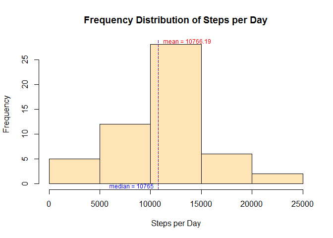
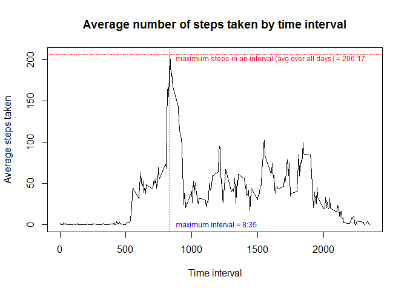
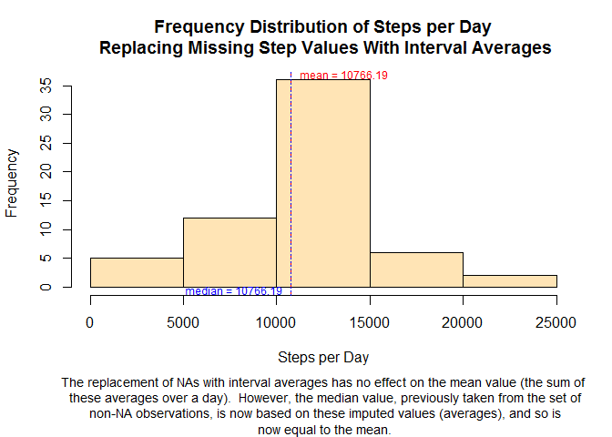
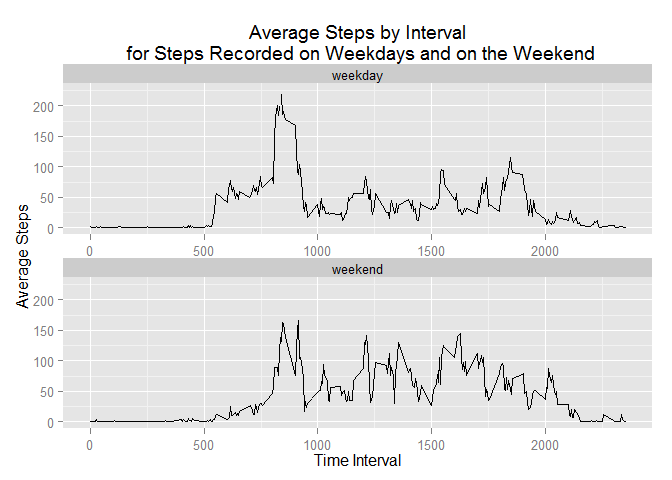

# Reproducible Research: Peer Assessment 1
Susan Hahn  
`r format(Sys.time(), '%d %B, %Y')`  

This is a brief analysis of activity monitoring data (activity.csv, downloaded from https://d396qusza40orc.cloudfront.net/repdata%2Fdata%2Factivity.zip), a file containing activity data for one person collected over a three month period.  These data were collected using a personal activity monitoring device storing observations at five minute intervals throughout each day.  The file contains 17,568 observations of three variables:  

* steps -- number of steps taken  
* date -- date on which steps were taken and recorded  
* interval -- specific five minute interval in which data was collected (hour and minute)  

## Loading and preprocessing the data


```r
# Data file read into actDat, actDat.noNA created from
# actDat with NAs removed, required libraries loaded

actDat <- read.csv("./data/activity.csv", stringsAsFactors=FALSE)
actDat.noNA <- na.omit(actDat)

# To examine the basic structure of the dataframe created 
# from activity.csv, and variable summaries before and
# after removal of the NAs.  Notice that the number of
# observations falls to 15,264 when the NAs are removed.

str(actDat)
```

```
## 'data.frame':	17568 obs. of  3 variables:
##  $ steps   : int  NA NA NA NA NA NA NA NA NA NA ...
##  $ date    : chr  "2012-10-01" "2012-10-01" "2012-10-01" "2012-10-01" ...
##  $ interval: int  0 5 10 15 20 25 30 35 40 45 ...
```

```r
summary(actDat)
```

```
##      steps            date              interval     
##  Min.   :  0.00   Length:17568       Min.   :   0.0  
##  1st Qu.:  0.00   Class :character   1st Qu.: 588.8  
##  Median :  0.00   Mode  :character   Median :1177.5  
##  Mean   : 37.38                      Mean   :1177.5  
##  3rd Qu.: 12.00                      3rd Qu.:1766.2  
##  Max.   :806.00                      Max.   :2355.0  
##  NA's   :2304
```

```r
summary(actDat.noNA)
```

```
##      steps            date              interval     
##  Min.   :  0.00   Length:15264       Min.   :   0.0  
##  1st Qu.:  0.00   Class :character   1st Qu.: 588.8  
##  Median :  0.00   Mode  :character   Median :1177.5  
##  Mean   : 37.38                      Mean   :1177.5  
##  3rd Qu.: 12.00                      3rd Qu.:1766.2  
##  Max.   :806.00                      Max.   :2355.0
```

```r
# Required packages
require(dplyr)
```

```
## Loading required package: dplyr
## 
## Attaching package: 'dplyr'
## 
## The following object is masked from 'package:stats':
## 
##     filter
## 
## The following objects are masked from 'package:base':
## 
##     intersect, setdiff, setequal, union
```

```r
require(stringr)
```

```
## Loading required package: stringr
```

```r
require(ggplot2)
```

```
## Loading required package: ggplot2
```
  
## What is the mean total number of steps taken per day?  

#### The mean number of steps recorded per day is 10,766.19, and the median is 10,765.

```r
# Using "no NA" version of data, steps are summarised by
# date, a histogram of steps per day is prepared with lines
# for mean and median added

by_Date <- group_by(actDat.noNA, date)
daySteps <- summarise(by_Date, tSteps = sum(steps))

hist(daySteps$tSteps,xlab="Steps per Day", main="Frequency Distribution of Steps per Day", col="moccasin")

meanSteps <- round(mean(daySteps$tSteps, na.rm=TRUE), 2)
abline(v = meanSteps, col = "red", lwd = 1, lty=2)
meanOut <- paste("mean =", toString(meanSteps))
text(meanSteps,28.65, pos=4, meanOut, cex=0.75, col = "red")

medianSteps <- median(daySteps$tSteps, na.rm=TRUE)
abline(v = medianSteps, col = "blue", lwd=1, lty=3)
medianOut <- paste("median =", toString(medianSteps))
text(medianSteps,-0.5, pos=2, medianOut, cex=0.75, col = "blue")
```

 

## What is the average daily activity pattern?  

#### On average, daily activity begins shortly after 5:00, with peak daily activity around mid-morning (average steps more than double any other interval during the day). Average step values vary up and down across the rest of the day with a final, general decline beginning in the early evening.

```r
# Using "no NA" version of data, steps are averaged by
# interval,  a line plot of average steps taken per
# interval is prepared with a horizontal line added at
# the maximum steps taken in an interval, and a vertical
# line added to identify that interval

by_Interval <- group_by(actDat.noNA, interval)
intSteps <- summarise(by_Interval, mSteps = mean(steps))
summary(intSteps) # summary of variables in intSteps, used in this plot and in imputing missing values in part 4
```

```
##     interval          mSteps       
##  Min.   :   0.0   Min.   :  0.000  
##  1st Qu.: 588.8   1st Qu.:  2.486  
##  Median :1177.5   Median : 34.113  
##  Mean   :1177.5   Mean   : 37.383  
##  3rd Qu.:1766.2   3rd Qu.: 52.835  
##  Max.   :2355.0   Max.   :206.170
```

```r
plot(intSteps$interval, intSteps$mSteps, type="l",  main="Average number of steps taken by time interval", xlab="Time interval", ylab="Average steps taken")

maxSteps <- max(intSteps$mSteps)
print(maxSteps)
```

```
## [1] 206.1698
```

```r
for(i in 1:nrow(intSteps)) {
    if(round(intSteps$mSteps[i], 2) == round(maxSteps, 2)) {
        maxInt <- intSteps$interval[i]
    }
}

abline(v = maxInt, col = "blue", lwd=1, lty=3)

maxIOut <- paste("maximum interval = ", str_sub(maxInt,1,1), ":", str_sub(maxInt, 2, 3), sep = "")
text(maxInt, 0, pos=4, maxIOut, cex=0.75, col = "blue")

abline(h=maxSteps, col="red", lwd=1, lty=4)
maxSOut <- paste("maximum steps in an interval (avg over all days) =", round(maxSteps, 2))
text(maxInt, maxSteps-5, maxSOut, pos=4, cex=0.75, col = "red")
```

 

## Imputing missing values  

#### Missing step values are imputed using the mean steps per interval variable created in part3 (intSteps dataset).  This dataset is merged with the date and interval data from observations removed in part 1 due to missing step values.  To provide a complete dataset with missing values filled in, these observations with estimated steps are appended to the dataset used previously in parts 2 and 3.

```r
# A subset of records containing "NA" for steps is taken
# from actDAt, steps variable is dropped, dataset is merged
# with intSteps dataset created in part 3 (containing mean
# steps by interval), variable names are added, dataset is
# appended to "no NA" dataset, a histogram of steps per day
# is prepared with lines for mean and median added

actDat.allNA <- actDat[is.na(actDat$steps), ]

actDat.allNA <- actDat.allNA[ , 2:3]

actDat.wasNA <- merge(actDat.allNA, intSteps, by="interval") 

names(actDat.wasNA) <- c("interval", "date", "steps")
str(actDat.wasNA) #basic structure of new df containing obs with imputed step values
```

```
## 'data.frame':	2304 obs. of  3 variables:
##  $ interval: int  0 0 0 0 0 0 0 0 5 5 ...
##  $ date    : chr  "2012-10-01" "2012-11-30" "2012-11-04" "2012-11-09" ...
##  $ steps   : num  1.72 1.72 1.72 1.72 1.72 ...
```

```r
str(actDat.noNA) #basic structure of dataset with missing data obs removed
```

```
## 'data.frame':	15264 obs. of  3 variables:
##  $ steps   : int  0 0 0 0 0 0 0 0 0 0 ...
##  $ date    : chr  "2012-10-02" "2012-10-02" "2012-10-02" "2012-10-02" ...
##  $ interval: int  0 5 10 15 20 25 30 35 40 45 ...
##  - attr(*, "na.action")=Class 'omit'  Named int [1:2304] 1 2 3 4 5 6 7 8 9 10 ...
##   .. ..- attr(*, "names")= chr [1:2304] "1" "2" "3" "4" ...
```

```r
actDat.wimpNA <- rbind(actDat.noNA, actDat.wasNA)
summary(actDat) #variable summary for full combined df with imputed step values
```

```
##      steps            date              interval     
##  Min.   :  0.00   Length:17568       Min.   :   0.0  
##  1st Qu.:  0.00   Class :character   1st Qu.: 588.8  
##  Median :  0.00   Mode  :character   Median :1177.5  
##  Mean   : 37.38                      Mean   :1177.5  
##  3rd Qu.: 12.00                      3rd Qu.:1766.2  
##  Max.   :806.00                      Max.   :2355.0  
##  NA's   :2304
```

```r
by_Date2 <- group_by(actDat.wimpNA, date)
daySteps2 <- summarise(by_Date2, tSteps = sum(steps))

par(mar=c(8.1, 4.1, 4.1, 2.1)) #, mgp=c(2, 1, 0)) 
hist(daySteps2$tSteps,xlab="Steps per Day", main="Frequency Distribution of Steps per Day\n Replacing Missing Step Values With Interval Averages" , col="moccasin")
title(sub="The replacement of NAs with interval averages has no effect on the mean value (the sum of\n these averages over a day).  However, the median value, previously taken from the set of\n non-NA observations, is now based on these imputed values (averages), and so is\n now equal to the mean.\n", cex.sub=0.9, line=8)

meanSteps2 <- round(mean(daySteps2$tSteps, na.rm=TRUE), 2)
abline(v = meanSteps2, col = "red", lwd = 1, lty=2)
meanOut2 <- paste("mean =", toString(meanSteps2))
text(meanSteps2,36.9, pos=4, meanOut2, cex=0.75, col = "red")

medianSteps2 <- median(daySteps2$tSteps, na.rm=TRUE)
abline(v = medianSteps2, col = "blue", lwd=1, lty=3)
medianOut2 <- paste("median =", toString(round(medianSteps2, 2)))
text(medianSteps2,-0.7, pos=2, medianOut2, cex=0.75, col = "blue")
```

 

## Are there differences in activity patterns between weekdays and weekends?  

#### The monitored individual is active earlier in the morning on weekdays, and active later in the evening on weekends.  While the peak activity interval is on weekday mornings, the individual is more consistently active across the day on weekends.

```r
# Date values are converted to POSIXlt, date name is added,
# weekday/weekend indicator (factor) is created, steps are
# averaged by weekday vs. weekend and interval, a line plot
# of average steps by interval is created with separate
# panels for weekday and weekend

actDat.wimpNA$date <- strptime(actDat.wimpNA$date, "%Y-%m-%d")
actDat.wimpNA$day <- factor(weekdays(actDat.wimpNA$date))

for(j in 1:nrow(actDat.wimpNA)) {
    
    if(actDat.wimpNA$day[j] == "Saturday" | actDat.wimpNA$day[j] == "Sunday") {
        
        actDat.wimpNA$dayend[j] <- "weekend"       
        
    } else {
        
        actDat.wimpNA$dayend[j] <- "weekday"

    }
}

actDat.wimpNA$dayend <- factor(actDat.wimpNA$dayend)

subDat <- actDat.wimpNA[c("dayend", "interval", "steps")]

by_dayendint <- group_by(subDat, dayend, interval)
deiSteps <- summarise(by_dayendint, avgSteps = mean(steps))
print(deiSteps) #step data averaged by weekday/weekend and interval
```

```
## Source: local data frame [576 x 3]
## Groups: dayend
## 
##     dayend interval   avgSteps
## 1  weekday        0 2.25115304
## 2  weekday        5 0.44528302
## 3  weekday       10 0.17316562
## 4  weekday       15 0.19790356
## 5  weekday       20 0.09895178
## 6  weekday       25 1.59035639
## 7  weekday       30 0.69266247
## 8  weekday       35 1.13794549
## 9  weekday       40 0.00000000
## 10 weekday       45 1.79622642
## ..     ...      ...        ...
```

```r
ggplot(deiSteps, aes(x=interval, y=avgSteps)) + geom_line(stat="identity") + ggtitle("Average Steps by Interval\n for Steps Recorded on Weekdays and on the Weekend") + xlab("Time Interval") + ylab("Average Steps") + facet_wrap( ~ dayend, ncol=1, scale="free") + ylim(0, 225)
```

 
